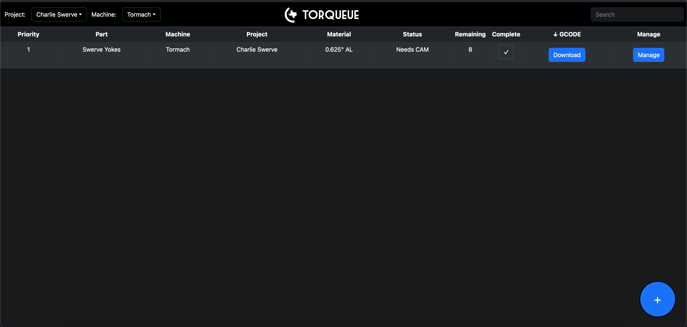
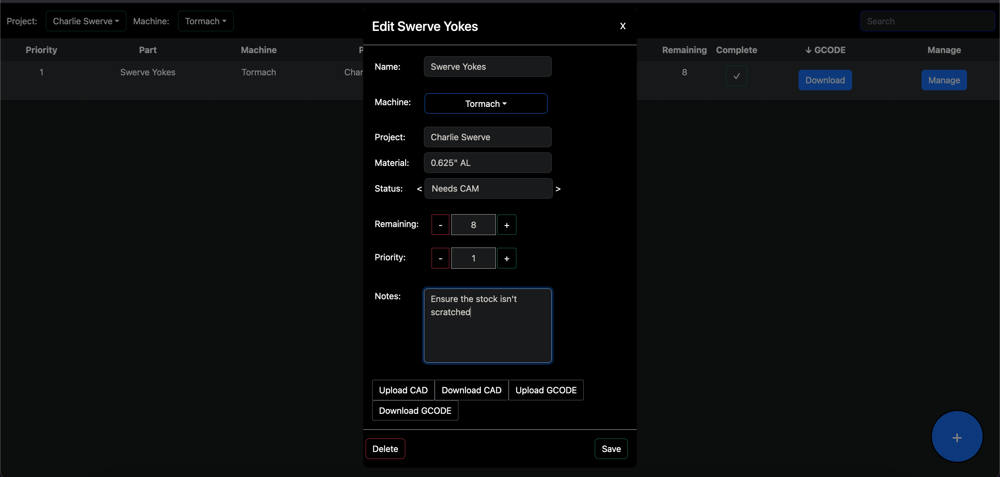

# Torqueue-Template

The template for Torqueue, a part designing, machining, and processing queue management website written with React and Firebase.





## Background

To setup Torqueue for your team, you will -

-   Clone this repository
-   Setup your database on Firebase
-   Setup authentication on Firebase (Strongly Recommended)
-   Add the API keys from Firebase to your repository
-   Setup Netlify and Render as cloud providers for deployment and hosting

## Git Setup/Cloning

-   If you don't already have [Git](https://git-scm.com/downloads) installed on your computer, do so now.
-   Next, press the green "Use this template" button near the top of the page, and then Create a new repository.
-   You'll be asked where you want to add the repository to, if your team has a Github Organization, you can create it there or add it to another account your team will have access to in the future.
-   The recommended settings for this repository is Private, and you can leave Include all branches unchecked.
-   From here, you'll be taken to the same repository, but now it's your teams!
-   To get a local copy of this code, copy the URL and then navigate to wherever you want to save the code to in the terminal ([instructions](https://www.techrepublic.com/article/16-terminal-commands-every-user-should-know/)), then type in the command as following:  
    `git clone https://github.com/...`
-   Now open up your newly cloned repository in your favorite IDE (preferrably Visual Studio Code)

## Setting up Firebase

-   Go to [Firebase](https://firebase.google.com/) and press Get Started
-   Sign in to a Google Account accessible to your team in the future, then Create a project
-   Choose a name for you database, and then accept the terms of service.
-   From here press the </> button (Add Firebase to the Web) and add a nickname.
-   When you see the code snippet generated by Firebase, copy the value for each key in the firebaseConfig, (apiKey: "AIz......", authDomain: "tor....", databaseURL: "htt...", projectId: "tor...", storageBucket: "tor...", messagingSenderId: "5...", appId: "1:...", and measurementId: "G-...") and leave it somewhere where where it can be referenced later. Then continue to console.

## Setting up RealTime Database

-   On the left side, under the build tab, click on Realtime Database, then Create Database, Next, and then Start in test mode, then Enable.

## Setting up Firebase Authentication

##### If you are okay with your Torqueue instance being open to the internet you can skip this step, and also look at the Skip Sign In Prompt step, but this is not recommended and you understand that Texas Torque and/or the creators of Torqueue are not to be held liable for any files and/or leaks that may occur, you have been warned!

-   Under the build tab on the left, press on Authentication, Get Started, and then Email/Password, and then select only the first switch for signing in with Email/Password.
-   Go to the Users tab, and then Add User. It's recommended to use a team email here, and then type in the password that you'd like to sign in with every time you try to access your Torqueue.

## Adding Your API Keys

-   Inside of the backend folder of your cloned repository, you should see a .env file and blank values inside for each of your Firebase API keys that you saved from the Setting Up Firebase step. Copy the values in leaving the quotation marks around them.
-   Do the same for the .env file in the client/src folder

```
API_KEY = "A..."
AUTH_DOMAIN =  "tor..."
DATABASE_URL =  "https://tor..."
PROJECT_ID =  "tor..."
STORAGE_BUCKET =  "tor..."
MESSAGING_SENDER_ID = "271....",
APP_ID =  "1..."
MEASUREMENT_ID =  "G-..."

PORT = "5738"
```

## Skip Sign In Prompt

-   If you are okay with leaving your Torqueue open to anyone on the internet, navigate to Dashboard.tsx in client/src/pages and set usingRecommendedAuth to false.

## Deciding Your Backend
- The backend is important because it acts a buffer between your client side code and your database. It prevents anyone from being able to go to your website and manipulate it using developer tools and being able to potentially download your parts. That being said, you will need to pick between Heroku and Render.
    - Render offers a 100% free tier, however it will autotimeout after 30 minutes of no requests and will take about 30-60 seconds to turn back on and process requests. This means that if you aren't on the website for more than 30 minutes, when you go to it, you won't be able to sign in or see your parts for another 30 seconds.
    - Heroku won't autotimeout, meaning that your website will always act properly, but does require a monthly subscription of $5 :(.
    - Secret option #3 is to have no backend and have all requests going to Firebase go from the frontend alone. This will allow your code 

## Pushing Your Changes


## Setting up Netlify and Render as Cloud Providers

-   In order to serve the backend and frontend, a computer is needed as a host so that other computers trying to connect to the website can recieve the content and API routes. Both Netlify and Render offer a free tier which we can utilize.

    ## Render
    - Go to [Render's Website](https://render.com/), create an account, and then navigate to the Dashboard.
    - On the Render dashboard, select new Web Service, then connect it to the Github account and then repository that your forked Torqueue is in.
